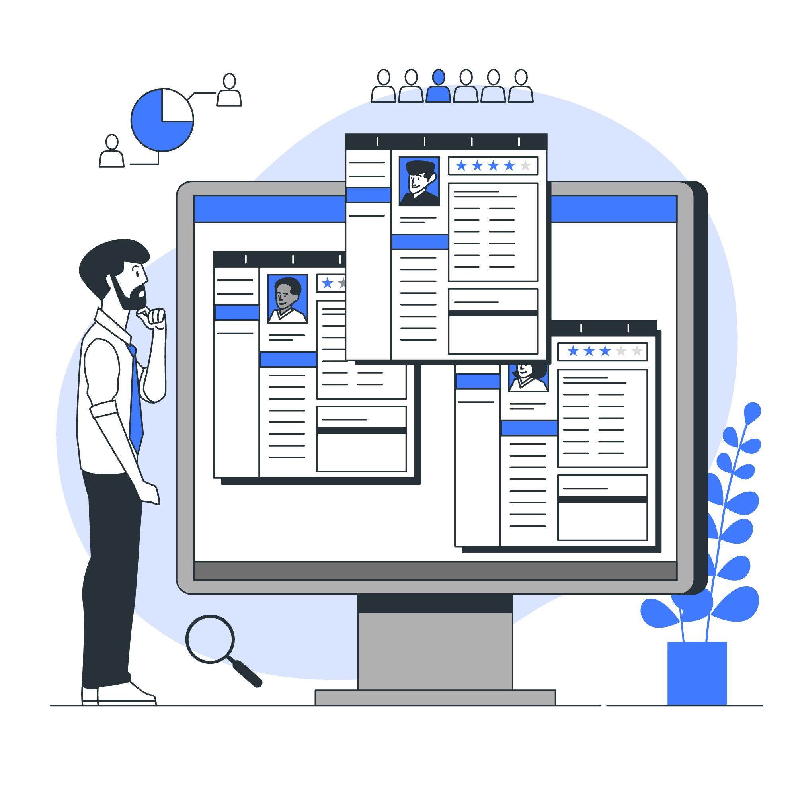

# CareerCraft: ATS-Optimized Resume Analyzer

CareerCraft is a cutting-edge project designed to revolutionize the job application process using advanced ATS (Applicant Tracking System) technology. This innovative system empowers job seekers by providing insights into their resumes' compatibility with job descriptions, highlighting missing keywords, and offering tailored profile summaries for optimal presentation to potential employers.

## ✨ Features

* ✅ ATS-Optimized Resume Analysis
* ✅ Resume Optimization Suggestions
* ✅ Missing Keywords Detection
* ✅ Personalized Profile Summaries
* ✅ Skill Gap Identification
* ✅ Career Guidance & Insights
* ✅ Intuitive & Interactive UI (built with Streamlit)

## 🔍 Use Case Scenarios

### 📌 Scenario 1: Resume Optimization

CareerCraft assists job seekers in optimizing their resumes for specific job openings. By analyzing job descriptions and resumes, CareerCraft identifies the percentage match between the two, suggests missing keywords, and offers recommendations to improve resume alignment with the desired job roles. This feature streamlines the application process and increases the chances of securing interviews.

### 📌 Scenario 2: Skill Enhancement

For individuals looking to enhance their skills and qualifications, CareerCraft serves as a valuable tool for identifying areas of improvement. By comparing resumes to industry-standard job descriptions, CareerCraft identifies skill gaps and provides personalized suggestions for skill development and enhancement. This feature empowers users to tailor their professional profiles to meet the demands of their desired career paths.

### 📌 Scenario 3: Career Progression Guidance

Professionals seeking career advancement opportunities can rely on CareerCraft for strategic guidance. By analyzing resumes and job descriptions, CareerCraft offers insights into potential career trajectories, identifies relevant skills and experiences, and provides personalized recommendations for achieving career goals. This feature helps users navigate their career paths effectively and capitalize on growth opportunities.

## 🛠️ Technologies Used

* [Streamlit](https://streamlit.io) – for building interactive web UI
* [Google Gemini API](https://ai.google.dev/) – for resume and job description analysis
* [Python](https://www.python.org/) – backend logic and PDF parsing
* [PyPDF2](https://pypi.org/project/PyPDF2/) – for reading resume PDF files
* [Pillow](https://pypi.org/project/Pillow/) – for image handling

## 🚀 How to Run the Project

```bash
# 1. Clone the Repository
https://github.com/your-username/CareerCraft.git

# 2. Install Required Packages
pip install -r requirements.txt

# 3. Create a .env File and Add Your Gemini API Key
GOOGLE_API_KEY=your_api_key_here

# 4. Run the Streamlit App
streamlit run app.py
```

## 🎥 Demo Video

[Click to Watch](https://www.example.com/demo-video)

## 📄 Documentation

[Detailed Report & Setup Guide (PDF)](https://www.example.com/documentation.pdf)

## 🖼️ Screenshots

| Dashboard                   | Upload Section              | Result Output               |
| --------------------------- | --------------------------- | --------------------------- |
|  |  |  |

## 📁 Project Structure

```
CareerCraft/
├── app.py                # Main Streamlit app
├── images/               # Icons and UI images
├── .env                  # Environment variables (add your API key here)
├── requirements.txt      # Python dependencies
├── README.md             # Documentation
```

## 📜 License

This project is open-source and available under the [MIT License](LICENSE).

---

Made with ❤️ by \[Your Name]
